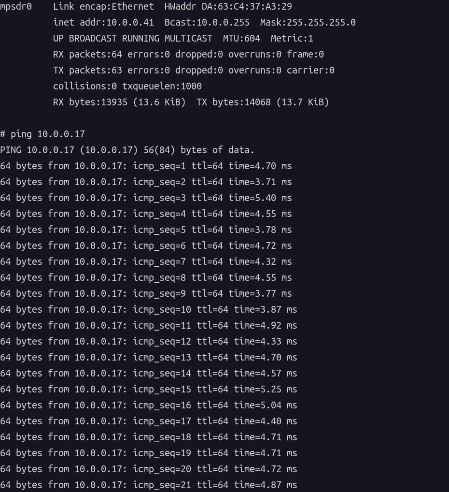
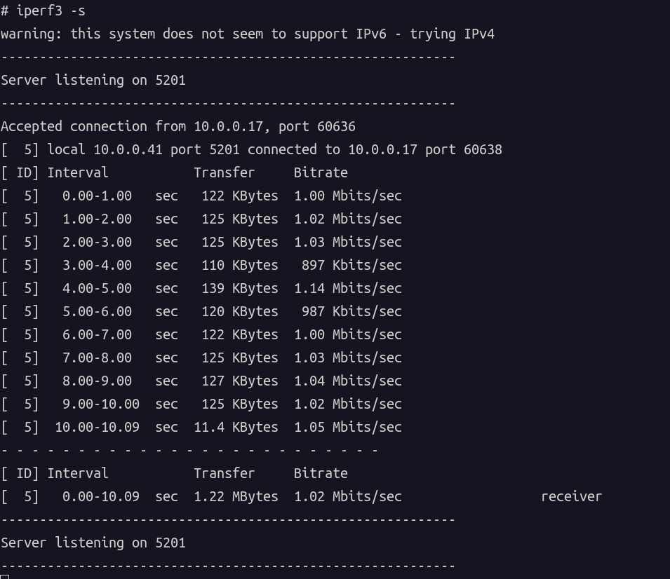
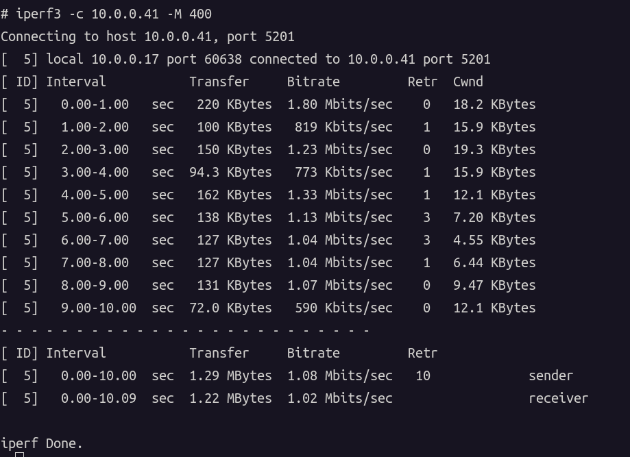

---

# 📡 AntSDR Mesh Network (Toy Project)

This is an **experimental Mesh networking firmware project** built on **AntSDR-E200**, aiming to explore and validate the **basic feasibility of SDR-based mesh networking** on real hardware.

> ⚠️ **Important Notice**
> This is a **toy-level project**.
> It is **not** a complete, mature, or high-performance Mesh networking implementation, and it is **not intended for production use**.

---

## 🎯 Project Goals

The purpose of this repository is **not** to build a full-featured wireless Mesh protocol stack.

Instead, the goals are to:

* Run a **minimum viable Mesh network prototype** on AntSDR-E200 hardware
  using a **simple and easy-to-understand implementation**
* Explore and validate:

  * Whether **SDR can support basic multi-node networking**
  * The behavior of **simple routing / forwarding mechanisms** over real RF channels
  * The end-to-end workflow of **FPGA + Linux + wireless link** cooperation
* Serve as a foundation for more advanced systems, such as:

  * MANET (Mobile Ad-Hoc Networks)
  * Cognitive radio networks
  * Distributed / cooperative SDR systems

---

### 🧸 Toy-Level Implementation
  * naive
  * brute-force
  * non-optimal
  
* Runs on **real AntSDR hardware**
* Operates over **real wireless channels**
* Not a pure simulation
* Not based on ns-3 or other idealized models

---

### 🚫 What This Project Does **Not** Aim to Do

At its current stage, this project does **not** aim for:

* ❌ High throughput or high reliability
* ❌ Full Mesh protocols (e.g. OLSR, HWMP)
* ❌ Strict MAC, QoS, or security mechanisms
* ❌ Standards compliance (this is **not** Wi-Fi Mesh and **not** IEEE 802.11s)

---
## Quick Start 

### Prerequisites / Preparation
- At least two AntSDR-E200 devices
- Prepare multiple USB Type-C cables or Gigabit Ethernet cables to connect to the AntSDR-E200 devices
- Download the test firmware for SD card boot, and replace the existing contents on the AntSDR-E200 SD card with this firmware

### How it works
#### A basic Ethernet-like network
Once the preparation is complete, you can log in to two or more AntSDR-E200 devices either via UART or SSH.
You will find a network interface named mpsdr0, which corresponds to the COFDM baseband implemented in the FPGA.

- on antsdr node1 we can get:
```bash
$ ssh root@192.168.1.10
root@192.168.1.10's password: 
Welcome to:
    ___    _   _____________ ____  ____ 
   /   |  / | / /_  __/ ___// __ \/ __ \
  / /| | /  |/ / / /  \__ \/ / / / /_/ /
 / ___ |/ /|  / / /  ___/ / /_/ / _, _/ 
/_/  |_/_/ |_/ /_/  /____/_____/_/ |_|  
                                       
v0.34-dirty
https://github.com/MicroPhase/antsdr-fw
# ifconfig 
eth0      Link encap:Ethernet  HWaddr 00:0A:35:00:01:22  
          inet addr:192.168.1.10  Bcast:0.0.0.0  Mask:255.255.255.0
          UP BROADCAST RUNNING MULTICAST  MTU:1500  Metric:1
          RX packets:288 errors:0 dropped:0 overruns:0 frame:0
          TX packets:207 errors:0 dropped:0 overruns:0 carrier:0
          collisions:0 txqueuelen:1000 
          RX bytes:27690 (27.0 KiB)  TX bytes:34095 (33.2 KiB)
          Interrupt:29 Base address:0xb000 

lo        Link encap:Local Loopback  
          inet addr:127.0.0.1  Mask:255.0.0.0
          UP LOOPBACK RUNNING  MTU:65536  Metric:1
          RX packets:12 errors:0 dropped:0 overruns:0 frame:0
          TX packets:12 errors:0 dropped:0 overruns:0 carrier:0
          collisions:0 txqueuelen:1000 
          RX bytes:1032 (1.0 KiB)  TX bytes:1032 (1.0 KiB)

mpsdr0    Link encap:Ethernet  HWaddr DA:63:C4:37:A3:29  
          inet addr:10.0.0.41  Bcast:10.0.0.255  Mask:255.255.255.0
          UP BROADCAST RUNNING MULTICAST  MTU:604  Metric:1
          RX packets:59 errors:0 dropped:0 overruns:0 frame:0
          TX packets:57 errors:0 dropped:0 overruns:0 carrier:0
          collisions:0 txqueuelen:1000 
          RX bytes:11905 (11.6 KiB)  TX bytes:11632 (11.3 KiB)

```

- on antsdr node2 we can get:
```bash
$ ssh root@192.168.3.10
root@192.168.3.10's password: 
Welcome to:
    ___    _   _____________ ____  ____ 
   /   |  / | / /_  __/ ___// __ \/ __ \
  / /| | /  |/ / / /  \__ \/ / / / /_/ /
 / ___ |/ /|  / / /  ___/ / /_/ / _, _/ 
/_/  |_/_/ |_/ /_/  /____/_____/_/ |_|  
                                       
v0.34-dirty
https://github.com/MicroPhase/antsdr-fw
# ifconfig 
eth0      Link encap:Ethernet  HWaddr 00:0A:35:00:01:22  
          inet addr:192.168.3.10  Bcast:0.0.0.0  Mask:255.255.255.0
          UP BROADCAST RUNNING MULTICAST  MTU:1500  Metric:1
          RX packets:188 errors:0 dropped:0 overruns:0 frame:0
          TX packets:149 errors:0 dropped:0 overruns:0 carrier:0
          collisions:0 txqueuelen:1000 
          RX bytes:20135 (19.6 KiB)  TX bytes:27432 (26.7 KiB)
          Interrupt:29 Base address:0xb000 

lo        Link encap:Local Loopback  
          inet addr:127.0.0.1  Mask:255.0.0.0
          UP LOOPBACK RUNNING  MTU:65536  Metric:1
          RX packets:12 errors:0 dropped:0 overruns:0 frame:0
          TX packets:12 errors:0 dropped:0 overruns:0 carrier:0
          collisions:0 txqueuelen:1000 
          RX bytes:1032 (1.0 KiB)  TX bytes:1032 (1.0 KiB)

mpsdr0    Link encap:Ethernet  HWaddr DA:61:B9:07:9F:11  
          inet addr:10.0.0.17  Bcast:10.0.0.255  Mask:255.255.255.0
          UP BROADCAST RUNNING MULTICAST  MTU:604  Metric:1
          RX packets:39 errors:0 dropped:0 overruns:0 frame:0
          TX packets:64 errors:0 dropped:0 overruns:0 carrier:0
          collisions:0 txqueuelen:1000 
          RX bytes:9446 (9.2 KiB)  TX bytes:13626 (13.3 KiB)

```

The default IP address of mpsdr0 is generated from the unique ID of the onboard QSPI Flash.
With two devices available, you can now use ping, iperf3, or other standard network tools to perform connectivity and performance tests.



We can configure one node as the iperf3 server and another node as the iperf3 client, and then use iperf3 to perform a simple bandwidth test.





#### Batman-adv node
Since each node presents itself as an Ethernet-like interface, standard Layer-2 Mesh solutions such as batman-adv can be directly applied to build a Mesh network over the AntSDR-E200 wireless link.
Using the tools provided by Linux, we can achieve this with minimal effort.

```bash
$ batctl if add mpsdr0
$ ip link set up dev bat0
$ suffix=$(ip -4 -o addr show dev mpsdr0 | awk '$3=="inet"{print $4; exit}' | cut -d. -f4 | cut -d/ -f1)
$ ip addr add 10.10.0.$suffix/24 dev bat0
$ ip link set bat0 up
$ ip addr flush dev mpsdr0

$ ifconfig 
bat0      Link encap:Ethernet  HWaddr BE:F2:04:AD:CF:24  
          inet addr:10.10.0.41  Bcast:0.0.0.0  Mask:255.255.255.0
          UP BROADCAST RUNNING MULTICAST  MTU:1500  Metric:1
          RX packets:1 errors:0 dropped:0 overruns:0 frame:0
          TX packets:1 errors:0 dropped:10 overruns:0 carrier:0
          collisions:0 txqueuelen:1000 
          RX bytes:42 (42.0 B)  TX bytes:54 (54.0 B)

$  batctl o 
[B.A.T.M.A.N. adv 2019.4, MainIF/MAC: mpsdr0/da:63:c4:37:a3:29 (bat0/be:f2:04:ad:cf:24 BATMAN_IV)]
   Originator        last-seen (#/255) Nexthop           [outgoingIF]
 * da:61:b9:07:9f:11    0.450s   (250) da:61:b9:07:9f:11 [    mpsdr0]

```

---
## Build Instructions

```bash
git clone -b antsdr_mesh --recursive https://github.com/MicroPhase/antsdr-fw-patch.git

export CROSS_COMPILE=arm-linux-gnueabihf- 
export PATH=$PATH:/opt/Xilinx/SDK/2019.1/gnu/aarch32/lin/gcc-arm-linux-gnueabi/bin 
export VIVADO_SETTINGS=/opt/Xilinx/Vivado/2019.1/settings64.sh
export PERL_MM_OPT=

export TARGET=antsdre200

cd antsdr-fw-patch
sh patch.sh e200


cd plutosdr-fw

make

make sdimg
```